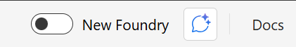
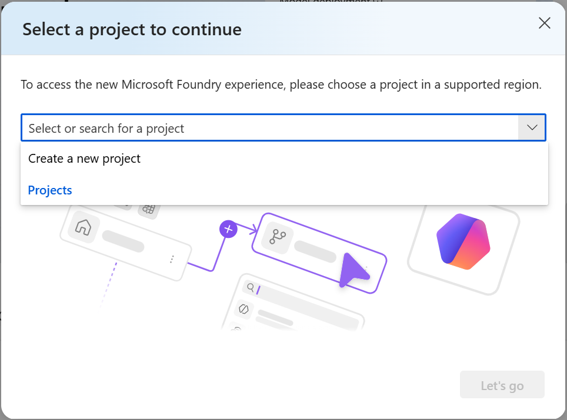

---
lab:
    title: 'Getting started: set up your environment'
    description: 'Shared setup for the Design agent workflows in Microsoft Foundry lab: create a Microsoft Foundry project. Complete this once before any task.'
    level: 300
    concepts: 'environment setup, Microsoft Foundry project'
    status: 'draft'
---

# Getting started

This page sets up everything the **Design agent workflows in Microsoft Foundry** lab needs.
**Every task begins here** — complete this page first. Each task is written so you can then do
it on its own; if you're working through the whole lab in one sitting, you only need to do this
setup once.

**Your scenario:** you work at **Tailwind Traders**, an outdoor-gear retailer that also runs
guided trips. Across the lab you'll design a workflow that triages customer support tickets —
classifying each one and routing it to the right place.

> **Note**: The workflow designer in Microsoft Foundry is currently in preview. You may
> experience some unexpected behavior, warnings, or errors. If you encounter an issue that
> blocks your progress, you may need to start over with a new project and workflow.

## Prerequisites

Before starting, ensure you have:

- An [Azure subscription](https://azure.microsoft.com/free/) with sufficient permissions and quota to provision Azure AI resources
- [Visual Studio Code](https://code.visualstudio.com/) installed on your local machine (only needed for the optional client-app task)
- [Python 3.13](https://www.python.org/downloads/) or later installed (only needed for the optional client-app task)
- [Git](https://git-scm.com/downloads) installed on your local machine (only needed for the optional client-app task)

> \* Python 3.14 is available, but some dependencies are not yet compiled for that release. The lab has been successfully tested with Python 3.13.12.

## Create a Microsoft Foundry project

Microsoft Foundry uses projects to organize models, resources, data, and other assets. You need
a project for this lab — you'll create the triage workflow inside it.

1. In a web browser, open the [Foundry portal](https://ai.azure.com) at `https://ai.azure.com` and sign in using your Azure credentials.

1. Ensure the **New Foundry** toggle is set to *On*.

    

1. You may be prompted to create a new project before continuing to the New Foundry experience. Select **Create a new project**.

    

    If you're not prompted, select the projects drop-down menu on the upper left, and then select **Create new project**.

1. Enter a name for your Foundry project (for example, `tailwind-support-project`) and select **Create**.

    Wait a few moments for the project to be created. The new Foundry portal home page should appear with your project selected.

1. Close the **Welcome to the new Microsoft Foundry** dialog if it appears.

    The dialog may prompt you to create an agent, which is not necessary at this time. Agents are created inside the workflow in a later step.

Keep this browser tab open — you'll use it in Task 1.

## Check you're ready

That's the only required setup for the **Core** and optional workflow tasks (Tasks 1–3), which
are all completed in the portal. When you're ready, head to any task:

| Task | Page | Extra setup needed |
| --- | --- | --- |
| Task 1 – Classify and route a support ticket | [D1](D1-classify-and-route-a-ticket.md) | None (portal only) |
| Task 2 – Handle low-confidence tickets | [D2](D2-handle-low-confidence-tickets.md) | The workflow from Task 1 |
| Task 3 – Generate recommended responses | [D3](D3-generate-recommended-responses.md) | The workflow from Task 1 |
| Task 4 – Call your workflow from a client app | [D4](D4-call-your-workflow-from-a-client-app.md) | VS Code, Python, and the starter code (see the task) |

> **Only doing Task 4?** The optional client-app task additionally needs VS Code, Python, and
> the starter code from `Labfiles/D-design-agent-workflows-in-foundry`. That task page walks
> you through cloning the repo and creating a virtual environment.

---

**Next:** [Task 1 — Classify and route a support ticket](D1-classify-and-route-a-ticket.md)
