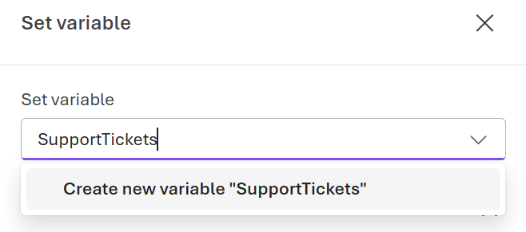
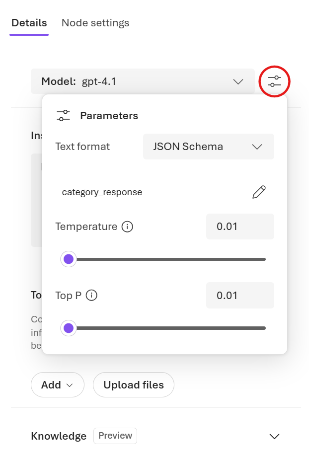

---
lab:
    title: 'Task 1 – Classify and route a support ticket'
    description: 'Design a sequential workflow in the Microsoft Foundry visual designer that loops over Tailwind Traders support tickets, classifies each with an AI agent, and routes it by category.'
    level: 300
    concepts: 'agent workflows, structured outputs, conditional routing'
    islab: true
    status: 'draft'
---

# Task 1 — Classify and route a support ticket

*Part of the **Design agent workflows in Microsoft Foundry** lab. New here? Start with [Getting started](D0-getting-started.md).*

> **What you need:** a **Microsoft Foundry project**. Don't have one yet? Complete
> [Getting started](D0-getting-started.md) first. This task is completed entirely in the
> portal — no local code or `.env` file is required.

---

You'll design a **sequential workflow** that triages Tailwind Traders support tickets. It loops
over a batch of tickets, asks an AI agent to classify each one, and then routes it: billing
issues are escalated to a human, while everything else stays on the automated path.

<style>
/* "Ask Anton" just-in-time concept blocks */
details.concept { margin:.6rem 0 1rem; }
details.concept > summary { display:inline-block; cursor:pointer; list-style:none;
  font-size:.85em; font-weight:600; color:#6b4ba1; background:#6b4ba112;
  border:1px solid #6b4ba133; border-radius:999px; padding:.2em .7em; }
details.concept > summary::-webkit-details-marker { display:none; }
details.concept > summary::before { content:"Ask Anton: "; font-weight:700;
  padding-left:1.5em;
  background:url("../Media/anton-avatar.png") left center / 1.25em 1.25em no-repeat; }
details.concept > summary:hover { background:#6b4ba1; color:#fff; border-color:#6b4ba1; }
details.concept[open] > summary { border-bottom-left-radius:0; border-bottom-right-radius:0; }
details.concept .concept-body { border:1px solid #6b4ba133; border-top:none;
  border-radius:0 8px 8px 8px; padding:.6rem .9rem; background:#6b4ba108; font-size:.95em; }
</style>

<details markdown="1" class="concept">
<summary>Why a structured (JSON) response?</summary>
<div class="concept-body" markdown="1">

An agent normally replies with free-form text — great for people, awkward for a workflow that
needs to *branch* on the answer. By giving the triage agent a **JSON Schema response format**,
you force it to return a predictable object (`category`, `confidence`, `customer_issue`). The
workflow can then read `Local.TriageOutputJson.category` and route on it reliably.

</div>
</details>

## Create a customer support triage workflow

In this section you'll create a workflow that triages support requests for **Tailwind
Traders**. The workflow uses an AI agent to classify each ticket and conditional logic to route
it.

1. On the Foundry portal home page, select **Build** from the toolbar menu.

1. On the left-hand menu, select **Agents**, then select the **Workflows** tab.

1. In the upper right corner, select **Create** > **Blank workflow** to create a new blank workflow.

    The type of workflow you'll create in this exercise is a sequential workflow. However, starting with a blank workflow simplifies the process of adding the necessary nodes.

1. Select **Save** in the visualizer to save your new workflow. In the dialog box, enter the name *Tailwind-Traders-Support-Triage*, and then select **Save**.

## Create a ticket array variable

1. In the workflow visualizer, select the **+** (plus) icon to add a new node.

1. In the workflow actions menu, under **Data transformation**, select **Set variable** to add a node that initializes an array of support tickets.

1. In the **Set variable** node editor, enter a name for a new variable, such as *SupportTickets*.

    

    The new variable should appear as `Local.SupportTickets`.

1. In the **To value** field, enter the following array of sample Tailwind Traders support tickets:

    ```output
   [
    "The GPS on my TrailMate hiking watch keeps losing signal even after I did a full factory reset.",
    "Is there a way to see all of my past orders and download them as receipts?",
    "I was charged twice for the same tent order last Friday and my card statement shows two payments. Can someone fix this?"]
    ```

    These three tickets deliberately cover one of each category you'll route on: **Gear**, **General**, and **Billing**.

1. Select **Done** to save the node.

## Add a for-each loop to process tickets

1. Select the **+** (plus) icon below the **Set variable** node and create a **For each** node to process each support ticket in the array.

1. In the **For each** node editor, set the **Select the items to loop for each** field to the variable you created earlier: `Local.SupportTickets`.

1. In the **Loop Value Variable** field, create a new variable named `CurrentTicket`.

1. Select **Done** to save the node.

## Invoke an agent to classify the ticket

1. Select the **+** (plus) icon within the **For each** node to add a new node that classifies the current support ticket.

1. In the workflow actions menu, under **Invoke**, select **Agent** to add an agent node.

1. In the **Agent** node editor, under **Select an agent**, select **Create new agent**.

1. Enter an agent name such as *Triage-Agent* and select **Create**.

### Configure the agent settings

1. In the editor, under **Details**, select the **Parameters** button near the model name.

    

1. In the **Parameters** pane, next to **Text format**, select **JSON Schema**.

1. In the **Add response format** pane, enter the following definition and select **Save**:

    ```json
    {
    "name": "category_response",
    "schema": {
        "type": "object",
        "properties": {
            "customer_issue": {
                "type": "string"
            },
            "category": {
                "type": "string"
            },
            "confidence": {
                "type": "number"
            }
        },
        "additionalProperties": false,
        "required": [
            "customer_issue",
            "category",
            "confidence"
        ]
    },
    "strict": true
    }
    ```

1. In the Agent Details pane, set the **Instructions** field to the following prompt:

    ```output
    Classify the customer's support message into exactly ONE category from the list below. Provide a confidence score from 0 to 1.

    Billing
    - Charges, refunds, duplicate payments
    - Missing or incorrect refunds on an order
    - Being charged the wrong price for an order or a gear rental

    Gear
    - Faulty, damaged, or defective equipment
    - Product setup, pairing, or usage problems
    - Unexpected behavior from gear or gadgets

    General
    - How-to questions
    - Product, trip, or stock availability
    - Order history, receipts, returns, or website navigation

    Important rules
    - Questions about viewing, downloading, or exporting orders or receipts are General, not Billing
    - Billing ONLY applies when money was charged, refunded, or paid incorrectly
    ```

1. Select **Node settings** to configure the input and output of the agent.

1. Set the **Input message** field to the `Local.CurrentTicket` variable.

1. Under **Save agent output message as**, create a new variable named `TriageOutputText`.

1. Under **Save the output json_object as**, create a new variable named `TriageOutputJson`.

1. Select **Done** to save the node.

## Route the ticket based on category

In this section you'll add conditional logic to route each ticket based on its classified
category. Billing tickets are escalated to a human; other tickets stay on the automated path.

1. Select the **+** (plus) icon below the **Invoke agent** node to add a new node that routes the ticket.

1. In the workflow actions menu, under **Flow**, select **If/Else** to add a conditional logic node.

1. In the **If/Else** node editor, select the **Add a path** button to create the if-branch condition, then select the pencil icon to edit the condition.

1. Set the **If Condition** to the following expression to check if the ticket category is "Billing":

    ```output
    Local.TriageOutputJson.category = "Billing"
    ```

1. Select **Done** to save the node.

### Escalate billing tickets

1. Select the **+** (plus) icon under the **If** branch of the **If/Else** node to add a new node.

1. In the workflow actions menu, under **Basics**, select **Deliver a message** to add a send message activity.

1. In the **Deliver a message** node editor, set the **Message to send** field to the following response:

    ```output
   Escalate billing issue to the Tailwind Traders orders team.
    ```

1. Select **Done** to save the node.

### Handle non-billing tickets automatically

1. Select the **+** (plus) icon under the **Else** branch of the **If/Else** node to add a new node.

1. In the workflow actions menu, under **Basics**, select **Deliver a message** to add a send message activity.

1. In the **Deliver a message** node editor, set the **Message to send** field to the following response:

    ```output
   Handling automatically: "{Local.CurrentTicket}"
    ```

    > In [Task 3](D3-generate-recommended-responses.md) you'll replace this placeholder message with a second AI agent that drafts a real, category-appropriate reply.

1. Select **Done** to save the node.

## Preview the workflow

1. Select the **Save** button to save all changes to your workflow.

1. Select the **Preview** button to start the workflow.

1. In the chat window that appears, enter some text to trigger the workflow, such as `Start processing support tickets.`

1. Observe the workflow as it processes each support ticket in sequence. Review the messages generated by the workflow in the chat window.

    You should see the billing ticket (the duplicate tent charge) flagged for escalation, while the gear and general tickets are handled on the automated path. For example:

    ```output
    Current Ticket:
    I was charged twice for the same tent order last Friday and my card statement shows two payments. Can someone fix this?


    Copilot said:
    Escalate billing issue to the Tailwind Traders orders team.
    ```

> ✅ **Checkpoint**: Your workflow loops over a batch of tickets, classifies each one with the
> Triage-Agent, and routes it by category — escalating billing issues while handling the rest
> automatically. You've built a working classify-and-route workflow entirely in the portal.

---

**Next (optional):** [Task 2 — Handle low-confidence tickets](D2-handle-low-confidence-tickets.md)
